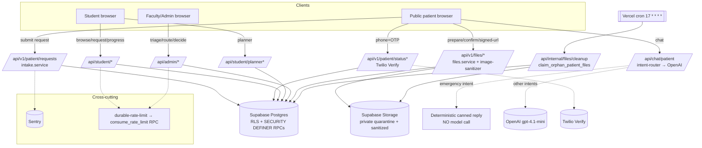

# 02 — System Architecture

- **Repository:** `dental-match` (DentBridge)
- **Purpose:** overall architecture, subsystem relationships, boundaries, interaction diagram.
- **Status:** Baseline (v2). **Scope:** `main` / `ab36262`. **Last reviewed:** 2026-07-27.
- Labels: VERIFIED / INFERENCE / NOT VERIFIED / RECOMMENDATION.

## Application boundary (VERIFIED)

One Next.js 16 App Router application (one `package.json`, one `next.config.ts`, one `src/app`). There is **no separate backend service**; server logic lives in App Router route handlers (`src/app/api/**/route.ts`, all `runtime = 'nodejs'`) and server-only library code (`src/lib/**`, several guarded by `server-only`). Persistence and authorization live in **Supabase Postgres** (RLS + `SECURITY DEFINER` RPCs). External dependencies are OpenAI (chat), Twilio Verify (OTP), Sentry (errors), and Vercel (host, cron, analytics/speed-insights).

There is **no `src/middleware.ts`** (VERIFIED — absent). Authorization is enforced at two layers instead: (1) per-route server checks using the SSR Supabase client (`src/lib/supabase-server.ts` → `createServerClient`), and (2) database RLS policies + role checks inside RPCs (`auth.jwt() -> 'app_metadata' ->> 'role'`).

## Subsystem map (VERIFIED)

| Subsystem | Location | Role |
|---|---|---|
| Public web + marketing | `src/app/{page,about,faq,privacy,terms,...}` | Anonymous informational surfaces |
| Patient intake & status | `src/app/patient/*`, `src/app/api/v1/patient/*`, `src/lib/patient-request/*`, `src/lib/patient-status/*` | Anonymous request submission + OTP status lookup |
| Case lifecycle engine | `src/lib/cases/*` + atomic RPCs | Triage → routing → student request → terminal-state transitions |
| File pipeline | `src/lib/files/*`, `src/app/api/v1/files/*`, `src/app/api/internal/files/cleanup` | Quarantine → sanitize → link → signed-url → cron cleanup |
| Identity & authz | `src/lib/roles.ts`, `src/lib/supabase-*.ts`, `src/lib/auth-invitations.ts`, `src/app/auth/*` | Supabase Auth, role gating, invitations, password flows |
| Audit & consent | `src/lib/audit/*`, `src/lib/consent/*` + phase-4 migrations | Append-only accountability + consent records |
| AI (Bridgey) | `src/app/api/chat/patient/*`, `src/lib/chat/*` | Public assistant with deterministic safety pre-routing |
| Clinical tools | `src/app/student/clinical-tools/*`, `src/app/student/planner/*`, `src/lib/planner/*` | Calculators + planner |
| Observability | `src/lib/observability/*`, `src/sentry.*`, `src/instrumentation*.ts` | Logging, Sentry, request context, PII scrubbing |
| Rate limiting | `src/lib/api/durable-rate-limit.ts` + `consume_rate_limit` RPC | Durable (DB-backed) + in-process rate limits |

## Authorization model (VERIFIED)

Roles are `'student' | 'faculty' | 'admin'` (`src/lib/roles.ts`). `canAccessFacultyPortal` grants faculty+admin. The **strongest** boundary is in Postgres: mutation RPCs (e.g. `admin_set_student_request_decision`, `admin_release_next_stage_with_decision`, `admin_set_case_terminal_state_with_decision`) re-check the JWT role server-side, lock the target row `FOR UPDATE`, validate the state transition, and return a structured `{ ok, code }` result — so even a bypassed API layer cannot drive an invalid transition. This "service-role mutation boundary with atomic RPCs" is the defining architectural strength.

## Interaction diagram (Mermaid)

## External boundaries (VERIFIED)

| Boundary | Direction | Detail |
|---|---|---|
| Browser ↔ Next.js (own origin) | both | 22 API routes, same-origin enforced on sensitive routes (`src/lib/api/same-origin.ts`) |
| Next.js ↔ Supabase | both | Postgres + Storage + Auth via `@supabase/ssr`/`supabase-js`; service-role key server-only |
| Next.js ↔ OpenAI | outbound | `responses.create`, `gpt-4.1-mini`, `store: false`, `safety_identifier` |
| Next.js ↔ Twilio Verify | outbound | OTP send/check (`src/lib/otp/twilio-verify.ts`) |
| App ↔ Sentry | outbound | Errors, with `sentry-privacy.ts` scrubbing |
| Vercel cron ↔ cleanup route | inbound | Authenticated by `CRON_SECRET` |

## Cross-repo boundary (VERIFIED)

A repo-wide search found **no code path** from DentBridge to the sibling `clinical-compass` or `dentbridge-perioflow` repositories. "Clinical Compass" and "Student AI Assistant" appear only as UI strings gated behind a `developmentFeatureKeys` set (`src/app/students/students-client.tsx`) and Bridgey grounding copy that explicitly calls them "in development." DentBridge is architecturally standalone. See `18` for the full relationship analysis.
